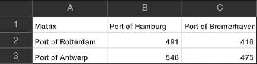
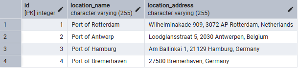
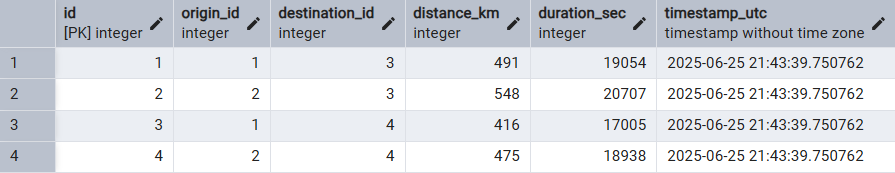

# Distance Matrix Generator

**A modular Python data pipeline that extracts real-world travel distances and durations from the Google Maps API, 
transforms them into a structured matrix, and optionally stores the results in a relational database for analytics, planning, or reporting.**  

The Distance Matrix Generator automates the process of retrieving travel distance and duration data between multiple geographic points using the Google Maps Distance Matrix API. 
It validates location inputs, handles API responses, and constructs a clean, structured matrix showing all origin–destination combinations. 
The data is simultaneously stored in a relational database alongside metadata for reproducibility and downstream analysis. 
Built with modular components and database-agnostic architecture, the system supports batch data processing and scales well for different use cases.

It is designed to:
- **Request Validation** – Verifies inputs before execution to avoid unnecessary API calls
- **Structured Data Parsing** – Stores raw JSON API responses with metadata and timestamps for traceability
- **All-Pairs Distance Calculation** – Computes distances and durations between every origin–destination pair
- **CSV Matrix Output** – Generates a clean CSV distance matrix
- **Database Integration** – Stores location and travel data in any supported SQL database via [SQLAlchemy Database Toolkit](https://github.com/Pymetheus/sqlalchemy-dbtoolkit)

This tool is ideal for:
- Logistics automation and fleet management
- Route and supply chain optimization
- Infrastructure and transport planning


## Table of Contents

- [Requirements](#requirements)
- [Getting Started](#getting-started)
  - [Installation](#installation)
  - [Configuration](#configuration)
  - [Usage](#usage)
  - [Output](#output)
- [Contributing](#contributing)
- [License](#license)


## Requirements

List of software, libraries, and tools needed to run the project:
- Google Maps API Key
- Python >= 3.8
- googlemaps >= 4.10.0
- sqlalchemy >= 2.0
- [sqlalchemy-dbtoolkit](https://github.com/Pymetheus/sqlalchemy-dbtoolkit) >= 0.1.7
- mysql-connector-python >= 9.3.0 (If working with MySQL)
- psycopg2 >= 2.9.0 (If working with PostgreSQL)
- pandas >= 2.2.0
- numpy >= 2.2.0


## Getting Started

Follow the instructions below to set up the project on a local machine.


### Installation

1. Clone the repository:   
```bash
git clone https://github.com/pymetheus/distance-matrix-generator.git
```
2. Install dependencies:

```bash
pip install git+https://github.com/pymetheus/sqlalchemy-dbtoolkit.git
pip install -r dep/requirements.txt
```


### Configuration

The Distance Matrix Generator loads the API key and database credentials from the **config.ini** file:  

1. Get your [Google Maps API Key](https://developers.google.com/workspace/guides/get-started)
2. Rename `your_config.ini` to `config.ini`, and update its values in the `.config/` folder.
3. Only fill in the section matching the database system you plan to use (e.g., MySQL, PostgreSQL, or SQLite).

```ini
[google]  
api_key = <your_api_key>

[mysql]  
user = <your_user>  
password = <your_password>  
host = localhost  
port = 3306  

[postgresql]
user = <your_user>  
password = <your_password>  
host = localhost  
port = 5432 

[sqlite]  
sqlite_path = /path/to/sqlite/databases  
```


### Usage

The data pipeline will:
- Fetch travel times and distances via the Google Maps API
- Store the raw response with a unique filename
- Generate a distance matrix and save it as a CSV file
- Optionally write data to your database


#### Data Input
Valid data type for origins and destinations is a single location, or a list of locations, where a location is:  
- **`string`** - Address string: *"New York, NY"* or PlaceID string: *"place_id:ChIJN1t_tDeuEmsRUsoyG83frY4"*  
- **`dictionary`** - Containing coordinates with lat/lng keys: *{"lat": 40.7128, "lng": -74.0060}*  
- **`tuple`** - Containing coordinates: *(34.0522, -118.2437)*  
- **`list`** - Containing a single string, dictionary or tuple: *["New York, NY", {"lat": 40.7128, "lng": -74.0060}, (34.0522, -118.2437)]*  

It's recommended to use location dictionaries `{label: location}` as input. This improves matrix readability and ensures the database stores locations with meaningful labels.
Extract the location values using `list(dict.values())` and pass them to the GoogleMapsFetcher. Use `list(dict.keys())` to retrieve the labels for the DistanceMatrixGenerator.  

Input data can be easily loaded with pandas. For example, from a CSV file:  

```python
import pandas as pd
locations_df = pd.read_csv('locations.csv')

origin_labels = locations_df['Label'][:2].tolist()
origin_addresses = locations_df['Address'][:2].tolist()

destination_labels = locations_df['Label'][2:].tolist()
destination_addresses = locations_df['Address'][2:].tolist()
```
*Note: the first two rows are used as origins, the rest as destinations.*


#### Default Pipeline

By default, the fetcher uses these [Google Maps Distance Matrix API settings](https://github.com/googlemaps/google-maps-services-python/blob/master/googlemaps/distance_matrix.py):  
- `mode`: `"driving"`
- `departure_time`: `"now"`  
These defaults are suitable for real-time distance estimation using current road conditions.

```python
from distance_matrix.fetcher import GoogleMapsFetcher
from distance_matrix.generator import DistanceMatrixGenerator

origin_dictionary = {
  "Port of Rotterdam": "Wilhelminakade 909, 3072 AP Rotterdam, Netherlands",
  "Port of Antwerp": "Loodglansstraat 5, 2030 Antwerpen, Belgium"
}

destination_dictionary = {
  "Port of Hamburg": "Am Ballinkai 1, 21129 Hamburg, Germany",
  "Port of Bremerhaven": "27580 Bremerhaven, Germany"
}

fetcher = GoogleMapsFetcher(list(origin_dictionary.values()),
                            list(destination_dictionary.values()))
fetcher.run_fetch_pipeline()
request_filename = fetcher.filename

generator = DistanceMatrixGenerator(request_filename,
                                    list(origin_dictionary.keys()),
                                    list(destination_dictionary.keys()),
                                    write_to_db=True,
                                    dbms='sqlite',
                                    db_name='test_distance_database')
generator.build_matrix()
```


#### Custom Pipeline

Customize travel settings to support advanced routing, scheduling, and planning scenarios.  

Use cases include:  
- Public transit route planning with minimal transfers
- Avoiding toll roads or ferries
- Scheduling for future departure times (Default timezone is UTC)

```python
from datetime import datetime
from distance_matrix.fetcher import GoogleMapsFetcher
from distance_matrix.generator import DistanceMatrixGenerator

origin_dictionary = {
  "Port of Rotterdam": "Wilhelminakade 909, 3072 AP Rotterdam, Netherlands",
  "Port of Antwerp": "Loodglansstraat 5, 2030 Antwerpen, Belgium"
}

destination_dictionary = {
  "Port of Hamburg": "Am Ballinkai 1, 21129 Hamburg, Germany",
  "Port of Bremerhaven": "27580 Bremerhaven, Germany"
}

fetcher = GoogleMapsFetcher(list(origin_dictionary.values()),
                            list(destination_dictionary.values()))
fetcher.api_payload["mode"] = "transit"
fetcher.api_payload["avoid"] = "ferries"
fetcher.api_payload["transit_mode"] = "train"
fetcher.api_payload["transit_routing_preference"] = "fewer_transfers"
fetcher.api_payload["departure_time"] = datetime.fromisoformat("2025-07-01 02:15:00")

fetcher.run_fetch_pipeline()
request_filename = fetcher.filename

generator = DistanceMatrixGenerator(request_filename,
                                    list(origin_dictionary.keys()),
                                    list(destination_dictionary.keys()),
                                    write_to_db=True,
                                    dbms='postgresql',
                                    db_name='test_distance_database')
generator.build_matrix()
```


### Output

After successful execution, you will receive:  

**Distance Matrix as CSV Output**  
Stored in the `data/processed/` folder with a filename based on the request.  
  

**Locations Table in PostgreSQL**  
  

**Distances Table in PostgreSQL**  
  


## Contributing

Contributions to this project are welcome! If you would like to contribute, please open an issue to discuss potential changes or submit a pull request.
For more details please visit the [contributing page](docs/CONTRIBUTING.md).


## License

This project is licensed under the [MIT License](LICENSE.md). You are free to use, modify, and distribute this code as permitted by the license.
